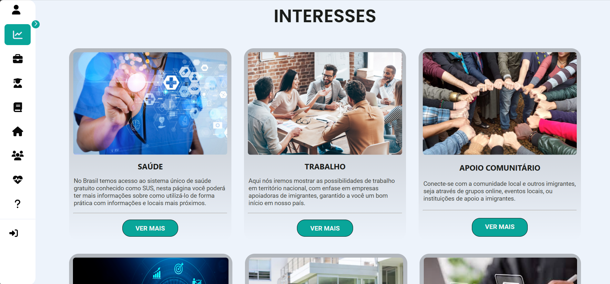

# How to Brasil

## O guia para você que está chegando no Brasil

How TO Brasil é um guia para imigrantes recém chegados no Brasil. Nosso objetivo é oferecer suporte e orientação em áreas vitais como saúde, trabalho, educação, documentação, moradia e recursos comunitários, visando facilitar a transição e integração de imigrantes na sociedade brasileira.

## Visual do Projeto

Aqui está uma captura de tela do projeto:




## Tecnologias Utilizadas 🛠

Este projeto utiliza as seguintes tecnologias:

- [React](https://reactjs.org/) 
- [TypeScript](https://www.typescriptlang.org/) 


## Execução local

### Como executar a aplicação

```bash
# Instalação de dependências
$ npm install

# Execução da aplicação
$ npm run dev
```
## Este projeto foi desenvolvido por:
<a href="https://www.linkedin.com/in/kayan-pereira-99a328282/">Kayan Pereira</a>
<a href="https://www.linkedin.com/in/gabriel-zardetti-barboza-bb20462ba/">Gabriel Zardetti</a>
<a href="https://github.com/GabrielFaria8">Gabriel Faria</a>
